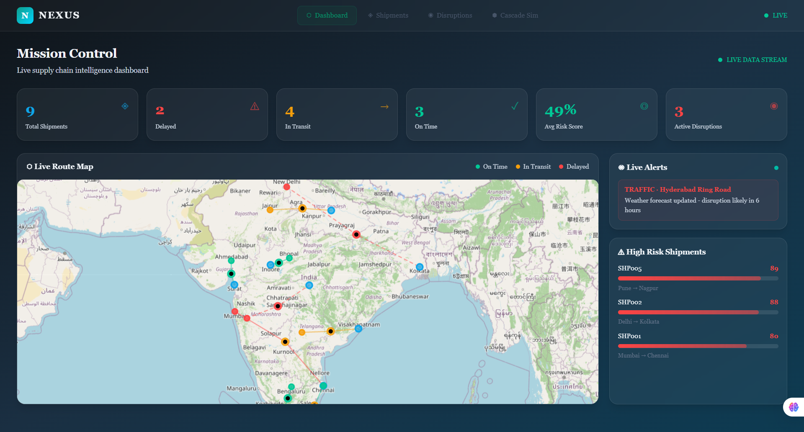
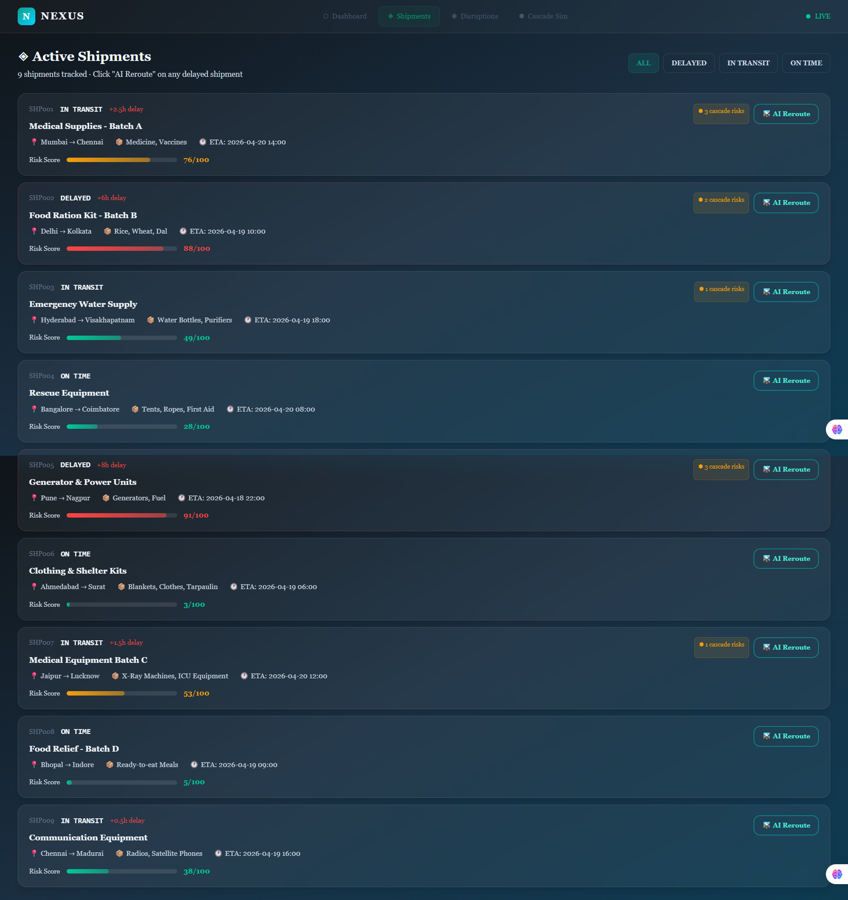
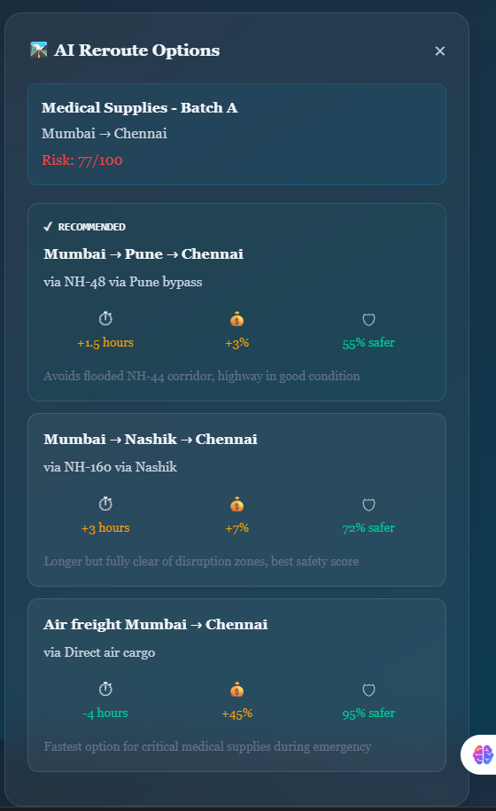
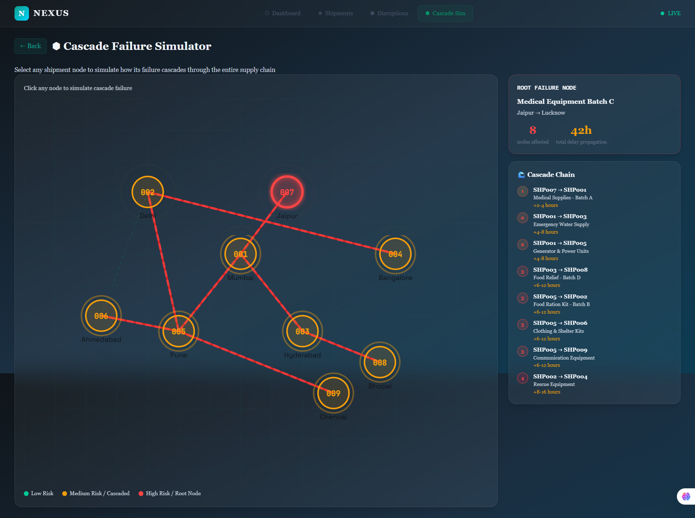
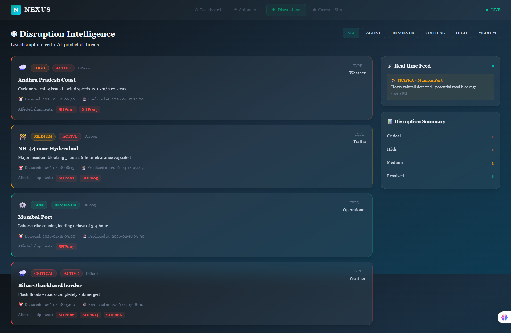

<div align="center">

# ⬡ NEXUS
### Intelligent Disaster Logistics Platform

**Predict. Route. Deliver. Before It's Too Late.**

[](https://nexus-app.vercel.app)
[](https://youtube.com/watch?v=YOUR_VIDEO_ID)
[](https://docs.google.com/presentation/d/YOUR_DECK_ID)

> Built for **Google Solution Challenge 2026** | SDG 9 · SDG 11 · SDG 13

</div>

---

## 🌍 Problem Statement

Every year, natural disasters affect **200+ million people** globally. The biggest killer isn't always the disaster itself — it's the failure to deliver aid in time. Supply chains break down, routes get blocked, and critical medical/food supplies sit stranded while people die.

NEXUS solves this with AI-powered logistics intelligence that predicts disruptions **before** they happen and automatically reroutes supplies in real-time.

---

## 🌟 What is NEXUS?
 
NEXUS is an AI-powered supply chain intelligence platform that helps governments, NGOs, hospitals, and suppliers deliver essential resources — food, medicine, water, and emergency kits — quickly during disasters such as floods, earthquakes, or pandemics.
 
---

## 🚀 Live Demo

| Resource | Link |
|----------|------|
| 🔴 Live App | https://nexus-app.vercel.app |
| 📹 Demo Video | https://youtube.com/watch?v=YOUR_VIDEO_ID |
| 📊 Project Deck | https://docs.google.com/presentation/d/YOUR_DECK_ID |
| 💻 GitHub | https://github.com/raziabegum705/nexus |

---

## ✨ Key Features

| Feature | Description |
|---------|-------------|
| 🗺️ **Live Route Map** | Real-time shipment tracking across India using Leaflet maps with risk heatmaps |
| 🤖 **AI Rerouting** | Gemini AI suggests 3 alternate routes instantly when a shipment is at risk |
| ⚡ **48hr Disruption Forecast** | Predicts supply chain failures before they happen |
| 🌊 **Cascade Failure Simulator** | Unique feature — simulate how one delay ripples through the entire supply chain |
| 📡 **Live Disruption Feed** | Real-time alerts for weather, traffic, and operational disruptions via Socket.IO |
| 📊 **Mission Control Dashboard** | Live KPIs: total shipments, delays, risk scores, active disruptions |
| 🔥 **Firebase Realtime DB** | All data persists and syncs live across all connected users |

---

## 🛠️ Tech Stack

| Layer | Technology |
|-------|-----------|
| Frontend | React 18, Vite, React Router |
| Maps | Leaflet.js + React-Leaflet |
| Backend | Node.js, Express, Socket.IO |
| Database | **Firebase Realtime Database** (Google) |
| AI | **Gemini 1.5 Flash** (Google) |
| Styling | Custom CSS |
| Deployment | Vercel (frontend) + Railway (backend) |
| SDGs | 9 (Industry & Infrastructure), 11 (Sustainable Cities), 13 (Climate Action) |
 
---

## 📱 Pages
 
| Page | URL | Description |
|------|-----|-------------|
| Landing | `/` | Hero page with live stats |
| Dashboard | `/dashboard` | Mission Control — live map + KPIs |
| Shipments | `/shipments` | AI reroute panel + shipment tracking |
| Disruptions | `/disruptions` | Live disruption intelligence feed |
| Cascade Sim | `/simulate` | 🔥 Cascade failure simulator |
 
---

## 📸 Screenshots

### Dashboard — Mission Control


### Live Shipment Tracking


### AI Rerouting (Gemini)


### Cascade Failure Simulator


### Disruption Intelligence Feed


---

## 🏃 Run Locally

### Prerequisites
- Node.js 18+
- Git installed
- Firebase project (free at [console.firebase.google.com](https://console.firebase.google.com))
- Gemini API key (free at [aistudio.google.com](https://aistudio.google.com))

### Setup

```bash
# Clone the repo
git clone https://github.com/raziabegum705/nexus.git
cd nexus
```

#### Server
```bash
cd server
npm install

# Copy env file and fill in your keys
cp .env.example .env

# Seed Firebase with initial data (run once)
npm run seed

# Start server
npm run dev
```

#### Client
```bash
cd client
npm install

# Copy env file and fill in your Firebase values

# Mac / Linux
cp .env.example .env

# Windows
copy .env.example .env

# Start client
npm run dev
```

Open http://localhost:5173


### 🔑 Optional — Gemini API
 
Create `server/.env` and add:
```
GEMINI_API_KEY=your_key_here
```
 
> Without it, AI rerouting still works with smart mock data ✅
 

---

## 🔥 Firebase Setup (5 minutes)

1. Go to [console.firebase.google.com](https://console.firebase.google.com)
2. Create a project named **nexus**
3. Realtime Database → Create database → **Start in test mode (development only)**
4. Project Settings → Service Accounts → Generate new private key → save as `server/serviceAccountKey.json` 

 ⚠️ Never commit this file to GitHub.

5. Project Settings → Your Apps → Add Web App → copy the config into `client/.env`
6. Run `cd server && npm run seed` to populate the database

---

## 🚀 Deploy

### Frontend → Vercel
1. Push to GitHub
2. [vercel.com](https://vercel.com) → New Project → Import repo
3. Root Directory: `client` | Framework: Vite
4. Add all `VITE_*` env vars from `client/.env`
5. Deploy → copy your live URL

### Backend → Railway
1. [railway.app](https://railway.app) → New Project → Deploy from GitHub
2. Root Directory: `server`
3. Add env vars: `GEMINI_API_KEY`, `FIREBASE_DB_URL`, `FIREBASE_SERVICE_ACCOUNT` (paste the JSON as one line)
4. Deploy → copy Railway URL → update `VITE_BACKEND_URL` in Vercel

---


## 🏗️ System Architecture
 
```
┌─────────────────────────────────────────────────────────────────────┐
│                          USER / BROWSER                             │
│              React 18 + Vite  |  Leaflet Maps  |  Custom CSS       │
│                                                                     │
│   /           /dashboard    /shipments   /disruptions   /simulate   │
│  Landing     Mission Ctrl   AI Reroute    Live Feed    Cascade Sim  │
└────────────────────────────┬────────────────────────────────────────┘
                             │  HTTP REST + WebSocket (Socket.IO)
                             ▼
┌─────────────────────────────────────────────────────────────────────┐
│                       BACKEND  (Railway)                            │
│                    Node.js + Express Server                         │
│                                                                     │
│  ┌──────────────┐  ┌─────────────────┐  ┌────────────────────────┐ │
│  │  REST API    │  │  Socket.IO Hub  │  │   Seed / Data Layer    │ │
│  │  /api/route  │  │  Live shipment  │  │   npm run seed →       │ │
│  │  /api/ships  │  │  updates every  │  │   populates Firebase   │ │
│  │  /api/disrupt│  │  4 seconds      │  │   with initial data    │ │
│  └──────┬───────┘  └────────┬────────┘  └────────────────────────┘ │
│         │                   │                                       │
│         └──────────┬────────┘                                       │
│                    │                                                 │
│         ┌──────────▼──────────┐                                     │
│         │   Gemini 1.5 Flash  │  ← AI Rerouting Engine             │
│         │   Google AI API     │    3 alternate routes on demand     │
│         └─────────────────────┘                                     │
└────────────────────────────┬────────────────────────────────────────┘
                             │  Firebase Admin SDK
                             ▼
┌─────────────────────────────────────────────────────────────────────┐
│                  FIREBASE REALTIME DATABASE  (Google)               │
│                                                                     │
│   shipments/      disruptions/      routes/      kpis/             │
│   (live status)   (active alerts)   (map data)   (dashboard stats) │
│                                                                     │
│         Syncs live across all connected clients in real-time        │
└─────────────────────────────────────────────────────────────────────┘
```
 
### Data Flow — AI Rerouting
 
```
User flags at-risk shipment
        │
        ▼
React client  ──POST /api/reroute──▶  Express server
                                             │
                                             ▼
                                     Gemini 1.5 Flash
                                     (prompt: shipment
                                      context + risk data)
                                             │
                                             ▼
                                    3 alternate routes
                                    with risk scores
                                             │
                        ◀────────────────────┘
                    Response rendered on
                    Leaflet map in real-time
```
 
### Cascade Failure Simulation Flow
 
```
Select a node to fail  →  Mark upstream shipments at-risk
       │
       ▼
Ripple effect calculated across dependency graph
       │
       ▼
Affected shipments highlighted on map + dashboard KPIs update
       │
       ▼
AI suggests recovery routes for all impacted nodes
```
 
### Project Structure
 
```
nexus/
├── client/                  # React 18 + Vite frontend
│   ├── src/
│   │   ├── pages/           # Landing, Dashboard, Shipments,
│   │   │                    # Disruptions, Simulate
│   │   ├── components/      # Map, KPI cards, Disruption feed
│   │   └── App.jsx          # React Router setup
│   └── .env.example         # Firebase config template
│
├── server/                  # Node.js + Express backend
│   ├── index.js             # Express + Socket.IO entry point
│   ├── routes/              # /api/reroute, /api/shipments, etc.
│   ├── seed.js              # Firebase data seeder
│   ├── serviceAccountKey.json  # Firebase Admin credentials (gitignored)
│   └── .env.example         # GEMINI_API_KEY, FIREBASE_DB_URL
│
├── screenshots/             # App screenshots for README
├── .gitignore
└── README.md
```
 

 ---

## 🎯 SDG Alignment
 
| SDG | Goal | How NEXUS Contributes |
|-----|------|-----------------------|
| **SDG 9** | Industry, Innovation & Infrastructure | Resilient supply chain infrastructure through intelligent routing |
| **SDG 11** | Sustainable Cities & Communities | Faster aid delivery builds disaster-resilient communities |
| **SDG 13** | Climate Action | Weather-aware logistics adapts to climate-driven disruptions |
 
---

## 👥 Team

| Name | Role |
|------|------|
| Nivedh Ireni | Project Lead, Team Coordination & Strategy |
| Ananya Darna | Backend Feature Development, Product Planning & Documentation |
| Razia Begum | Full Stack Development / Core Implementation |
| Bobbala Gopinadh Yadav | Testing, Research & Quality Assurance |

---


<div align="center">
Built with ❤️ by Team Midnight City 555 for Google Solution Challenge 2026
</div>
